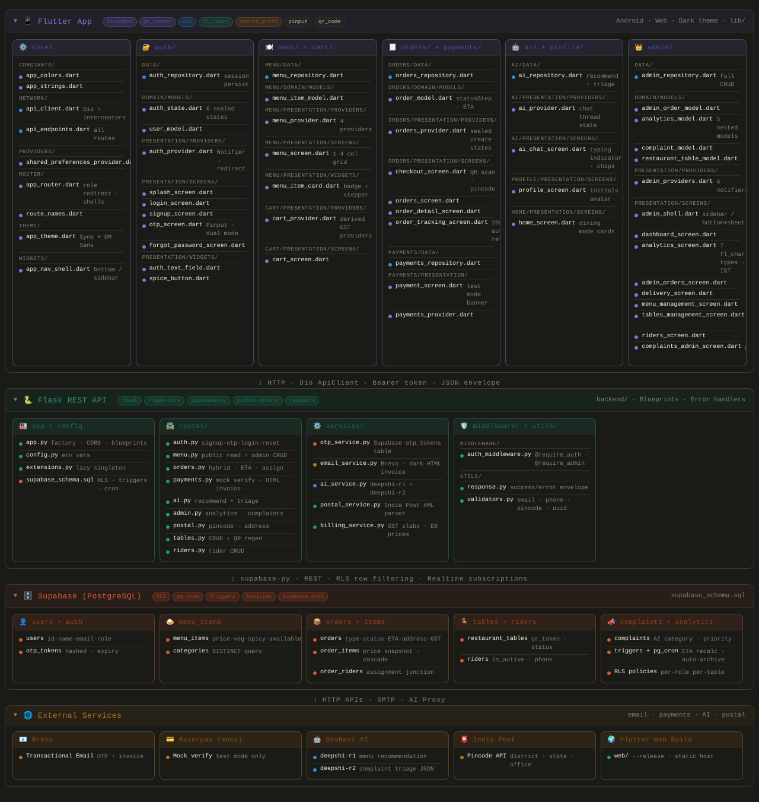

# Spice Route — Restaurant Order Management System

**DevNest Python Developer Internship — Week 2 Project**

A production-grade hybrid restaurant ordering system built with Python Flask, Supabase PostgreSQL, and Flutter. The system supports two distinct ordering modes — Dine-In via QR table scanning and Home Delivery via India Post pincode resolution — served from a single unified REST API. The Flutter application ships as a compiled Android APK and a Flutter Web build, both consuming the same backend deployed on Render.

---

## Live Links

| Artifact | URL |
|---|---|
| Backend API | `https://restaurant-hybrid-system.onrender.com` |
| Health Check | `https://restaurant-hybrid-system.onrender.com/health` |
| Android APK | [Download from Releases](https://github.com/bitgamergws1/Restaurant-Hybrid-System/releases/download/SPICE_ROUTE_APK/app-release.apk) |
| GitHub Repository | `https://github.com/bitgamergws1/Restaurant-Hybrid-System` |

---

## Testing the Admin Dashboard

> The app automatically detects the logged-in user's `role` on every login. If `role` is `admin`, GoRouter's redirect guard fires immediately and routes directly to the Admin Dashboard — no manual navigation required.

Use these credentials on the login screen to access the Admin Dashboard:

| Field | Value |
|---|---|
| Email | `admin@spiceroute.com` |
| Password | `Admin@1234` |

After login, `app_router.dart` reads the `role` field from the session response. Because this account carries `role: admin`, it bypasses the customer home screen and opens `admin_shell.dart` → `dashboard_screen.dart` automatically. All admin tabs (Orders, Delivery, Menu, Tables, Riders, Complaints, Analytics) are immediately accessible.

---

## Architecture

<p align="center">
  
</p>

---

## Architecture in Detail

<p align="center">
  
</p>

---


## Repository Structure

```
Restaurant-Hybrid-System/
│
├── backend/                             Python Flask REST API
│   ├── app.py                           Application factory — CORS, blueprints, error handlers
│   ├── config.py                        All environment variable declarations
│   ├── extensions.py                    Supabase client singleton (lazy-initialized)
│   ├── requirements.txt                 Production Python dependencies
│   ├── supabase_schema.sql              Complete schema — tables, indices, RLS, triggers, cron
│   │
│   ├── routes/
│   │   ├── auth.py                      Signup, OTP verify, login, logout, forgot/reset password
│   │   ├── menu.py                      Public menu read + admin CRUD
│   │   ├── orders.py                    Hybrid order creation, status transitions, ETA, rider assign
│   │   ├── payments.py                  Mock Razorpay verification + HTML invoice email dispatch
│   │   ├── ai.py                        AI waiter recommendation + AI complaint triage
│   │   ├── admin.py                     Analytics, complaints management, user list, admin orders
│   │   ├── postal.py                    India Post pincode resolution
│   │   ├── tables.py                    Restaurant table CRUD + QR token regeneration
│   │   └── riders.py                    Delivery rider CRUD
│   │
│   ├── services/
│   │   ├── otp_service.py               Supabase-backed OTP create / verify / clear
│   │   ├── email_service.py             Brevo HTTP API — OTP emails and dark-theme HTML invoice
│   │   ├── ai_service.py                DevNest proxy bridge — deepshi-r1 and deepshi-r2
│   │   ├── postal_service.py            India Post API parser + structured delivery address builder
│   │   └── billing_service.py           GST calculation engine (prices always fetched from DB)
│   │
│   ├── middleware/
│   │   └── auth_middleware.py           require_auth / require_admin session decorators
│   │
│   └── utils/
│       ├── response.py                  Standardised success_response / error_response helpers
│       └── validators.py                Email, phone, pincode, UUID format validators
│
├── Flutter Project Code/                Flutter application source (Android + Web)
│   ├── pubspec.yaml                     All dependencies — Riverpod, GoRouter, Dio, fl_chart, etc.
│   └── lib/
│       ├── main.dart                    Entry point — ProviderScope, SharedPreferences seeding, dark theme
│       │
│       ├── core/                        App-wide infrastructure — no feature logic here
│       │   ├── constants/
│       │   │   ├── app_colors.dart      Single colour palette — backgrounds, surfaces, semantic colours
│       │   │   └── app_strings.dart     All user-facing text strings in one place
│       │   ├── network/
│       │   │   ├── api_client.dart      Dio wrapper — _AuthInterceptor, _LoggingInterceptor, envelope unwrap
│       │   │   └── api_endpoints.dart   ApiConfig (baseUrl, token key, timeout) + all route strings
│       │   ├── providers/
│       │   │   └── shared_preferences_provider.dart   sharedPreferencesProvider + apiClientProvider
│       │   ├── router/
│       │   │   ├── app_router.dart      GoRouter — role-based redirect, StatefulShellRoute, ShellRoute
│       │   │   └── route_names.dart     RouteNames (named routes) + RoutePaths (path strings)
│       │   ├── theme/
│       │   │   └── app_theme.dart       Full MaterialApp dark ThemeData — Syne + DM Sans, all component themes
│       │   └── widgets/
│       │       └── app_nav_shell.dart   Responsive customer shell — bottom nav (< 800 px) / left sidebar (>= 800 px)
│       │
│       └── features/                    One folder per product feature, each with data / domain / presentation
│           │
│           ├── auth/
│           │   ├── data/
│           │   │   └── auth_repository.dart         Login, signup, OTP verify/resend, forgot/reset password, session persist
│           │   ├── domain/
│           │   │   └── models/
│           │   │       ├── auth_state.dart           Sealed AuthState — Initial, Loading, Authenticated, Unauthenticated, Error, OtpPending
│           │   │       └── user_model.dart           Immutable UserModel — id, name, email, role, phone
│           │   └── presentation/
│           │       ├── providers/
│           │       │   └── auth_provider.dart        AuthNotifier (Notifier<AuthState>) — drives GoRouter redirects
│           │       ├── screens/
│           │       │   ├── splash_screen.dart        Animated logo + grid painter — holds while session is checked
│           │       │   ├── login_screen.dart         Email + password form, forgot password link
│           │       │   ├── signup_screen.dart        Name, email, phone (optional), password form
│           │       │   ├── otp_screen.dart           6-digit Pinput — handles both signup verify and reset OTP phases
│           │       │   └── forgot_password_screen.dart   Email entry → triggers reset OTP
│           │       └── widgets/
│           │           ├── auth_text_field.dart      Branded input — animated label, focus glow, password toggle
│           │           └── spice_button.dart         Primary CTA (gradient) + outline variant
│           │
│           ├── home/
│           │   └── presentation/
│           │       └── screens/
│           │           └── home_screen.dart          Landing dashboard — hero greeting, quick actions, dining mode cards, recent orders
│           │
│           ├── menu/
│           │   ├── data/
│           │   │   └── menu_repository.dart          getMenu (with filters) + getCategories
│           │   ├── domain/
│           │   │   └── models/
│           │   │       └── menu_item_model.dart       MenuItemModel — id, name, price, category, tags, isVeg, isSpicy
│           │   └── presentation/
│           │       ├── providers/
│           │       │   └── menu_provider.dart         menuItemsProvider + categoriesProvider + selectedCategoryProvider + searchQueryProvider
│           │       ├── screens/
│           │       │   └── menu_screen.dart           Responsive grid (1–4 cols), floating search bar, category chip strip
│           │       └── widgets/
│           │           └── menu_item_card.dart        Card with image, veg/spicy badges, add-to-cart / qty stepper
│           │
│           ├── cart/
│           │   └── presentation/
│           │       ├── providers/
│           │       │   └── cart_provider.dart         CartNotifier — add, remove, removeAll, clear + derived subtotal/GST/total providers
│           │       └── screens/
│           │           └── cart_screen.dart           Item list with qty stepper, bill summary panel, checkout CTA
│           │
│           ├── orders/
│           │   ├── data/
│           │   │   └── orders_repository.dart         createOrder, getOrder, getUserOrders, sendInvoice
│           │   ├── domain/
│           │   │   └── models/
│           │   │       └── order_model.dart           OrderModel + OrderItemModel — status helpers, shortId, eta, statusStep
│           │   └── presentation/
│           │       ├── providers/
│           │       │   └── orders_provider.dart       userOrdersProvider, orderDetailProvider, CreateOrderNotifier (sealed state)
│           │       └── screens/
│           │           ├── checkout_screen.dart       Order type picker, dine-in (QR scan) / delivery (pincode) fields, summary
│           │           ├── orders_screen.dart         Paginated user order history list
│           │           ├── order_detail_screen.dart   Status hero card, items, bill, track/pay/resend-invoice actions
│           │           └── order_tracking_screen.dart Timeline with 20 s auto-refresh, ETA card, rider card
│           │
│           ├── payments/
│           │   ├── data/
│           │   │   └── payments_repository.dart       verifyPayment (mock Razorpay), sendInvoice
│           │   └── presentation/
│           │       ├── providers/
│           │       │   └── payments_provider.dart     PaymentNotifier + InvoiceNotifier (both sealed state)
│           │       └── screens/
│           │           └── payment_screen.dart        Amount hero, test-mode banner, mock method tiles, success screen
│           │
│           ├── profile/
│           │   └── presentation/
│           │       └── screens/
│           │           └── profile_screen.dart        Avatar initials, account info card, nav shortcuts, logout confirmation sheet
│           │
│           ├── ai/
│           │   ├── data/
│           │   │   └── ai_repository.dart             getRecommendation, triageComplaint
│           │   └── presentation/
│           │       ├── providers/
│           │       │   └── ai_provider.dart           AiChatNotifier (chat thread) + TriageNotifier (sealed state)
│           │       └── screens/
│           │           └── ai_chat_screen.dart        Chat UI — message bubbles, typing indicator, suggestion chips, input bar
│           │
│           └── admin/
│               ├── data/
│               │   └── admin_repository.dart          All admin API calls — analytics, orders, menu, tables, riders, complaints, users
│               ├── domain/
│               │   └── models/
│               │       ├── admin_order_model.dart     AdminOrderModel + AdminRiderInfo — needsRider, deliveryAddressLine helpers
│               │       ├── analytics_model.dart       AnalyticsData, AnalyticsSummary, DailyBreakdown, TopItem, ComplaintsSummary
│               │       ├── complaint_model.dart       ComplaintModel — priorityOrder helper for sorting
│               │       └── restaurant_table_model.dart   RestaurantTableModel + RiderModel
│               └── presentation/
│                   ├── providers/
│                   │   └── admin_providers.dart       AdminAnalyticsNotifier, AdminOrdersNotifier, AdminMenuNotifier,
│                   │                                  AdminTablesNotifier, AdminRidersNotifier, AdminComplaintsNotifier
│                   └── screens/
│                       ├── admin_shell.dart           Responsive shell — sidebar (>= 720 px) / bottom nav + More sheet (< 720 px)
│                       ├── dashboard_screen.dart      KPI tiles, quick action row, live active orders preview
│                       ├── admin_orders_screen.dart   All orders, status + type filter chips, confirm dialog, per-card spinner
│                       ├── delivery_screen.dart       Delivery-only orders, rider assignment picker, out-for-delivery action
│                       ├── menu_management_screen.dart   Item list, availability toggle, image URL preview, create/edit sheet
│                       ├── tables_management_screen.dart Status-coloured grid, create/edit sheet, QR regeneration
│                       ├── riders_screen.dart         Rider list, active toggle, create/edit bottom sheet
│                       ├── analytics_screen.dart      7 chart types — revenue trend, orders volume, peak hours, pie charts,
│                       │                              status distribution, ogive, top items; IST bucketing throughout
│                       └── complaints_admin_screen.dart   Status tabs, priority filter popup, quick-advance button, detail sheet
│
└── web/                                 Flutter Web production build (compiled static output)
    └── (flutter build web --release --base-href / output — deploy to any static host)
```

---

## Tech Stack

| Layer | Technology |
|---|---|
| Backend language | Python 3.11+ |
| Backend framework | Flask 3.0 |
| Database | Supabase (PostgreSQL 15) |
| Database client | supabase-py 2.5 |
| Password hashing | Werkzeug PBKDF2-SHA256 |
| Transactional email | Brevo HTTP API (replaces SMTP) |
| AI gateway | DevNest Proxy — deepshi-r1, deepshi-r2 |
| Pincode resolution | India Post public API |
| Deployment | Render (gunicorn, 2 workers) |
| Flutter version | Flutter 3 / Dart 3.3+ |
| State management | Flutter Riverpod 2 |
| Routing | GoRouter 14 |
| HTTP client | Dio 5 with auth interceptor |
| Charts | fl_chart 0.69 |
| QR scanner | mobile_scanner 5 |
| Local persistence | SharedPreferences |
| Animations | flutter_animate 4 |

---

## Internship Brief — Requirements Coverage

| Requirement from Brief | How It Is Implemented |
|---|---|
| Display restaurant menu | `GET /api/v1/menu/` with `category`, `search`, `available` query params |
| Add / update / remove food items | Admin CRUD on `/api/v1/menu/` — POST, PATCH, DELETE |
| Food categories and pricing | `category`, `subcategory`, `price`, `tags` columns with live filters |
| Customer order placement | `POST /api/v1/orders/` — routes dine-in and delivery from one endpoint |
| Quantity selection | Per-item `quantity` field validated (must be positive integer) |
| Multiple item ordering | Accepts array of `{menu_item_id, quantity}` objects in one payload |
| Automatic bill generation | `billing_service.py` calculates before any DB write; frontend prices ignored |
| GST / tax calculation | 18% GST applied to subtotal; `gst_amount` stored separately |
| Invoice formatting | Dark-themed responsive HTML invoice emailed via Brevo |
| Final amount calculation | `subtotal + gst_amount = total_amount` rounded to 2 decimal places |
| Store customer orders | `orders` + `order_items` tables in Supabase with full relational structure |
| Maintain order history | `GET /api/v1/orders/user/<user_id>` returns paginated history |
| Retrieve previous order records | `GET /api/v1/orders/<order_id>` with joined items |
| Total orders tracking | `/api/v1/admin/analytics` — total, paid, cancelled, dine-in, delivery counts |
| Daily revenue calculation | Daily breakdown array in analytics response, sorted newest first |
| Most sold items analysis | Pareto sort by quantity sold, top 20 returned |
| Sales summary generation | Full summary object — revenue, GST collected, average order value |
| Flask API for orders / menu | All routes under `/api/v1/` using Flask Blueprints |
| GET / POST request handling | All standard HTTP verbs implemented with proper status codes |
| Database integration | Supabase PostgreSQL with full schema, indices, triggers, RLS |
| Deployment on Render | gunicorn start command, health check endpoint at `/health` |
| README documentation | This file |

### Bonus Features Implemented Beyond the Brief

- OTP-based email verification for signup and password reset
- Dine-In QR mode — customer scans table QR, `table_id` auto-populated
- India Post pincode API integration for delivery address resolution
- Coordinate storage (`lat`, `lng`) on delivery orders
- AI Waiter Recommendation (deepshi-r1) — context-aware menu suggestions
- AI Complaint Triage (deepshi-r2) — auto-classifies category, sentiment, priority
- Identity leak sanitiser — strips underlying model identity from AI responses
- Smart menu selection — keyword + tag scoring picks the 60 most relevant items for AI context
- Mock Razorpay payment verification with test-mode ID validation
- Session-based authentication with `X-Session-Token` header
- Role-based access control — `customer`, `staff`, `admin`
- Restaurant table management with QR token regeneration
- Delivery rider management with active/inactive toggle
- Real-time order tracking timeline with 20-second auto-refresh
- ETA system — admin sets `eta_minutes`, customer sees countdown
- Rider assignment — admin assigns active rider to delivery orders
- Flutter analytics dashboard — revenue trend, peak hours, ogive chart, status distribution
- Flutter admin panel — responsive sidebar (desktop) / bottom nav (mobile)
- Row Level Security on all 10 Supabase tables
- pg_cron jobs — auto-purge expired OTPs and sessions every 2 minutes
- Cross-platform Flutter build — Android APK + Web

---

## Backend Architecture

### Application Factory Pattern

`app.py` uses Flask's application factory pattern via `create_app()`. This allows gunicorn to call the factory directly without importing a module-level app object, making the startup command `gunicorn "app:create_app()"`.

All nine blueprints are registered with versioned prefixes under `/api/v1/`. CORS is configured to allow the Flutter web origin via the `FRONTEND_ORIGIN` environment variable.

### Authentication Flow

Authentication is session-based. On successful login or OTP verification, the backend inserts a 64-character hex token into the `sessions` table with a 24-hour expiry. The client attaches this token as `X-Session-Token` on every protected request.

The `auth_middleware.py` decorators (`require_auth`, `require_admin`) resolve the token on each request, check expiry, and attach `request.current_user`. Expired sessions are deleted on access. pg_cron also hard-deletes all expired sessions every 2 minutes.

```
Client                 Flask                  Supabase               Brevo
  |                      |                       |                     |
  |-- POST /signup -----> |                       |                     |
  |                       |-- delete old OTPs --> |                     |
  |                       |-- insert new OTP ---> |                     |
  |                       |-- POST send email --------------------------------> |
  |<-- 201 -------------- |                       |               email sent
  |                       |                       |                     |
  |-- POST /verify-otp -> |                       |                     |
  |                       |-- select OTP record -> |                     |
  |                       |   check expiry + replay guard               |
  |                       |-- mark is_verified --> |                     |
  |                       |-- insert user -------> |                     |
  |                       |-- insert session ----> |                     |
  |<-- 201 + token ------- |                       |                     |
```

OTP replay is blocked by the `is_verified` flag — once used, the record cannot be used again. The cron job deletes it within 2 minutes regardless.

### Billing Engine

`billing_service.py` is called before any order row is written. Prices are always read from the `menu_items` table — any price the client sends is discarded. This prevents price tampering from the frontend.

```
unit_price (from DB) × quantity = item_total       (per line item)
sum(all item_total)              = subtotal
subtotal × 0.18                  = gst_amount
subtotal + gst_amount            = total_amount
```

All values are rounded to 2 decimal places before storage.

### Order Status Machine

Status transitions are enforced server-side. Invalid transitions return `400` with the list of allowed next states.

```
pending ──> confirmed ──> preparing ──> ready ──> out_for_delivery ──> delivered
pending ──> cancelled
confirmed ──> cancelled
```

### AI Service Architecture

Both AI features route through the DevNest proxy at `https://devnest-proxy-server.onrender.com/v1/proxy/ai`.

**AI Waiter (deepshi-r1):** Before calling the model, `_select_menu_items()` scores every available menu item against the user prompt using keyword matching on name, category, subcategory, description, and tags. The top 60 most relevant items are sent as context. This replaced the original approach of sending the first 50 items by sort order.

**Complaint Triage (deepshi-r2):** The model is instructed to return raw JSON only. The response is cleaned of markdown fences, validated against allowed enum values, and stored in the `complaints` table with category, sentiment, and priority.

Both calls include:
- Auto-retry on HTTP 502/503/504 (cold-start protection on Render free tier)
- `_strip_thinking()` — removes leaked `<thinking>` blocks and raw SSE reasoning fragments
- `_sanitise_identity()` — replaces any leaked underlying model identity with the restaurant name

### Supabase Schema Design

The schema is entirely defined in `supabase_schema.sql` and can be deployed in one run in the Supabase SQL Editor. It includes:

- 10 tables with appropriate constraints and check conditions
- 25+ indices covering all foreign keys, filter columns, and a GIN full-text index on `menu_items.name`
- `fn_set_updated_at()` trigger function applied to 6 tables
- Row Level Security enabled on all tables
- Two pg_cron jobs registered automatically

---

## Database Schema

### `users`
| Column | Type | Notes |
|---|---|---|
| id | UUID | Primary key |
| name | VARCHAR(255) | |
| email | VARCHAR(255) | Unique, indexed |
| phone | VARCHAR(20) | Optional |
| password_hash | TEXT | Werkzeug PBKDF2-SHA256 |
| role | VARCHAR(20) | `customer`, `admin`, `staff` |
| is_verified | BOOLEAN | Set true after OTP confirmation |

### `user_otps`
| Column | Type | Notes |
|---|---|---|
| email | VARCHAR(255) | Indexed with purpose |
| otp_code | VARCHAR(6) | 6-digit numeric, cryptographically generated |
| purpose | VARCHAR(20) | `signup` or `reset` |
| metadata | JSONB | Holds signup payload until OTP verified |
| expires_at | TIMESTAMPTZ | 5 minutes from creation |
| is_verified | BOOLEAN | Marked true on use — blocks replay |

### `sessions`
| Column | Type | Notes |
|---|---|---|
| user_id | UUID | FK to users |
| token | TEXT | 64-char hex, sent as `X-Session-Token` |
| expires_at | TIMESTAMPTZ | 24 hours from creation |

### `menu_items`
| Column | Type | Notes |
|---|---|---|
| name | VARCHAR(255) | GIN full-text search index |
| price | NUMERIC(10,2) | Non-negative, always read server-side |
| category | VARCHAR(100) | Indexed |
| subcategory | VARCHAR(100) | Optional |
| is_available | BOOLEAN | Indexed — used in all live filters |
| tags | TEXT[] | Used by AI scoring — `veg`, `spicy`, `bestseller`, etc. |
| sort_order | INTEGER | Controls display order |

### `restaurant_tables`
| Column | Type | Notes |
|---|---|---|
| table_number | VARCHAR(20) | Unique (e.g. T-01) |
| capacity | INTEGER | Min 1 |
| floor | VARCHAR(50) | e.g. Ground Floor |
| status | VARCHAR(20) | `free`, `occupied`, `reserved`, `inactive` |
| qr_token | TEXT | UUID-based, regeneratable |

### `riders`
| Column | Type | Notes |
|---|---|---|
| name | VARCHAR(255) | |
| phone | VARCHAR(20) | Unique, validated as 10-digit Indian mobile |
| is_active | BOOLEAN | Only active riders can be assigned to orders |

### `orders`
| Column | Type | Notes |
|---|---|---|
| order_type | VARCHAR(20) | `dine_in` or `delivery` |
| table_id | VARCHAR(50) | Dine-in only — matched against `restaurant_tables` |
| delivery_address | JSONB | Structured — address_line, area, district, state, pincode |
| delivery_coordinates | JSONB | `{lat, lng}` — stored from client GPS input |
| status | VARCHAR(30) | Transition-enforced via `VALID_STATUS_TRANSITIONS` |
| subtotal | NUMERIC(10,2) | |
| gst_amount | NUMERIC(10,2) | 18% of subtotal |
| total_amount | NUMERIC(10,2) | Final billed amount |
| payment_status | VARCHAR(20) | `pending`, `paid`, `failed`, `refunded` |
| estimated_delivery_time | TIMESTAMPTZ | Set by admin for delivery orders |
| estimated_table_time | TIMESTAMPTZ | Set by admin for dine-in orders |
| rider_id | UUID | FK to riders — set via assign-rider endpoint |
| invoice_sent | BOOLEAN | Prevents duplicate invoice emails |

### `order_items`
| Column | Type | Notes |
|---|---|---|
| item_name | VARCHAR(255) | Snapshotted at order time — preserved if menu item deleted |
| quantity | INTEGER | Min 1 |
| unit_price | NUMERIC(10,2) | Snapshotted from DB — frontend value discarded |
| item_total | NUMERIC(10,2) | unit_price × quantity |

### `complaints`
| Column | Type | Notes |
|---|---|---|
| raw_text | TEXT | Original complaint text |
| category | VARCHAR(100) | AI: `food_quality`, `delivery`, `service`, `billing`, `hygiene`, `other` |
| sentiment | VARCHAR(50) | AI: `positive`, `neutral`, `negative`, `very_negative` |
| priority | VARCHAR(20) | AI: `low`, `medium`, `high`, `critical` |
| status | VARCHAR(30) | `open` → `in_review` → `resolved` → `closed` |

### `payments`
| Column | Type | Notes |
|---|---|---|
| razorpay_payment_id | TEXT | Indexed |
| razorpay_order_id | TEXT | |
| amount | NUMERIC(10,2) | |
| status | VARCHAR(20) | `pending`, `success`, `failed` |
| gateway_response | JSONB | Full payload from Razorpay / mock |
| verified_at | TIMESTAMPTZ | Timestamp of successful verification |

---

## Row Level Security

RLS is enabled on all 10 tables. The Flask backend uses the `service_role` key which bypasses RLS. The policies block all direct anon key access to protect against the Supabase auto-generated REST API being hit without going through Flask.

| Table | anon key | service_role key |
|---|---|---|
| `users` | Blocked | Full access |
| `user_otps` | Blocked | Full access |
| `sessions` | Blocked | Full access |
| `menu_items` | SELECT on available items only | Full access |
| `restaurant_tables` | SELECT on non-inactive (QR scan) | Full access |
| `orders` | Blocked | Full access |
| `order_items` | Blocked | Full access |
| `complaints` | Blocked | Full access |
| `payments` | Blocked | Full access |
| `riders` | Blocked | Full access |

---

## API Reference

**Base URL:** `https://restaurant-hybrid-system.onrender.com/api/v1`

All protected routes require:
```
X-Session-Token: <token from /auth/login or /auth/verify-otp>
```

All responses follow the envelope:
```json
{ "success": true, "message": "...", "data": { ... } }
```

---

### Auth — `/api/v1/auth`

| Method | Route | Auth | Description |
|---|---|---|---|
| POST | `/signup` | Public | Create account, send OTP to email |
| POST | `/verify-otp` | Public | Verify OTP — activates account or confirms reset |
| POST | `/resend-otp` | Public | Resend a fresh OTP |
| POST | `/login` | Public | Authenticate, receive session token |
| POST | `/logout` | Token | Delete session from DB |
| POST | `/forgot-password` | Public | Send password reset OTP |
| POST | `/reset-password` | Public | Set new password, invalidate all sessions |

**POST /signup**
```json
{
  "name": "Priya Sharma",
  "email": "priya@example.com",
  "password": "securepass123",
  "phone": "9876543210"
}
```

**POST /verify-otp**
```json
{ "email": "priya@example.com", "otp": "482910", "purpose": "signup" }
```
Response `201`:
```json
{
  "data": {
    "user": { "id": "...", "name": "Priya Sharma", "email": "...", "role": "customer" },
    "token": "a3f8c2d1..."
  }
}
```

**POST /reset-password**
```json
{ "email": "priya@example.com", "otp": "193847", "new_password": "newpass456" }
```
Invalidates all existing sessions for that user after success.

---

### Menu — `/api/v1/menu`

| Method | Route | Auth | Description |
|---|---|---|---|
| GET | `/` | Public | Full menu with optional filters |
| GET | `/categories` | Public | All active category names |
| GET | `/<item_id>` | Public | Single menu item |
| POST | `/` | Admin | Create menu item |
| PATCH | `/<item_id>` | Admin | Partial update |
| DELETE | `/<item_id>` | Admin | Remove item |

**GET /** — Query params: `available=true`, `category=Starters`, `search=paneer`

**POST /** — Create item
```json
{
  "name": "Paneer Tikka",
  "description": "Marinated cottage cheese grilled in tandoor",
  "price": 280,
  "category": "Starters",
  "subcategory": "Vegetarian",
  "is_available": true,
  "tags": ["veg", "spicy", "bestseller"],
  "sort_order": 5
}
```

---

### Orders — `/api/v1/orders`

| Method | Route | Auth | Description |
|---|---|---|---|
| POST | `/` | Token | Create order (dine-in or delivery) |
| GET | `/<order_id>` | Token | Get order with items |
| PATCH | `/<order_id>/status` | Admin | Advance order status |
| PATCH | `/<order_id>/eta` | Admin | Set estimated time |
| PATCH | `/<order_id>/assign-rider` | Admin | Assign delivery rider |
| GET | `/user/<user_id>` | Token | User order history |

**POST /** — Dine-In
```json
{
  "order_type": "dine_in",
  "table_id": "T-04",
  "items": [
    { "menu_item_id": "uuid", "quantity": 2 },
    { "menu_item_id": "uuid", "quantity": 1 }
  ],
  "special_instructions": "No onions"
}
```

**POST /** — Home Delivery
```json
{
  "order_type": "delivery",
  "pincode": "400001",
  "address_line": "12 Marine Lines, near post office",
  "coordinates": { "lat": 18.9388, "lng": 72.8354 },
  "items": [
    { "menu_item_id": "uuid", "quantity": 1 }
  ]
}
```

Response `201`:
```json
{
  "data": {
    "order": { "id": "...", "status": "pending", "total_amount": 330.40 },
    "items": [ ... ],
    "billing": {
      "subtotal": 280.00,
      "gst_amount": 50.40,
      "gst_rate": 0.18,
      "total_amount": 330.40
    }
  }
}
```

**Status Transitions:**
```
pending ──> confirmed ──> preparing ──> ready ──> out_for_delivery ──> delivered
pending ──> cancelled
confirmed ──> cancelled
```
Invalid transitions return `400` with the list of allowed next states.

---

### Payments — `/api/v1/payments`

| Method | Route | Auth | Description |
|---|---|---|---|
| POST | `/verify` | Token | Verify payment, confirm order |
| POST | `/invoice/<order_id>` | Token | Email HTML invoice to registered email |

**POST /verify** — Mock Razorpay (test mode)
```json
{
  "order_id": "uuid",
  "razorpay_payment_id": "pay_TestMockXYZ123",
  "razorpay_order_id": "order_TestMockABC456"
}
```
On success: order marked `paid` + `confirmed`, invoice email dispatched automatically.

---

### AI — `/api/v1/ai`

| Method | Route | Auth | Description |
|---|---|---|---|
| POST | `/recommend` | Token | AI waiter food recommendation |
| POST | `/triage` | Token | AI complaint classification |
| GET | `/health` | Public | DevNest proxy health check |

**POST /recommend**
```json
{ "prompt": "kuch spicy aur vegetarian chahiye, light ho" }
```
Response — conversational recommendation in the same language as the prompt.

**POST /triage**
```json
{
  "raw_text": "Khana bohot thanda tha aur delivery mein 1 ghanta lag gaya",
  "order_id": "uuid"
}
```
Response `201`:
```json
{
  "data": {
    "complaint_id": "uuid",
    "triage": {
      "category": "delivery",
      "sentiment": "very_negative",
      "priority": "high"
    },
    "model_used": "deepshi-r2"
  }
}
```

---

### Admin — `/api/v1/admin`

| Method | Route | Auth | Description |
|---|---|---|---|
| GET | `/analytics` | Admin | Full analytics dashboard |
| GET | `/orders` | Admin | All orders with filters |
| GET | `/complaints` | Admin | All complaints with filters |
| PATCH | `/complaints/<id>/status` | Admin | Update complaint status |
| GET | `/users` | Admin | All registered users |

**GET /analytics** — Query params: `from=YYYY-MM-DD`, `to=YYYY-MM-DD`

Analytics response includes:
- Total, paid, cancelled, pending order counts
- Dine-in vs delivery split
- Total revenue, GST collected, subtotal, average order value
- Active tables count
- Daily revenue breakdown (newest first)
- Top 20 selling items by quantity (Pareto sorted)
- Complaints breakdown by priority and status
- Menu availability stats (total / available / unavailable)

---

### Tables — `/api/v1/tables`

| Method | Route | Auth | Description |
|---|---|---|---|
| GET | `/` | Admin | All tables |
| POST | `/` | Admin | Create table |
| PATCH | `/<table_id>` | Admin | Update table |
| DELETE | `/<table_id>` | Admin | Delete table |
| POST | `/<table_id>/regenerate-qr` | Admin | Regenerate QR token |

---

### Riders — `/api/v1/riders`

| Method | Route | Auth | Description |
|---|---|---|---|
| GET | `/` | Admin | All riders, optional `?active=true` filter |
| POST | `/` | Admin | Create rider |
| PATCH | `/<rider_id>` | Admin | Update name, phone, or active status |
| DELETE | `/<rider_id>` | Admin | Remove rider |

---

### Postal — `/api/v1/postal`

| Method | Route | Auth | Description |
|---|---|---|---|
| GET | `/<pincode>` | Token | Resolve 6-digit Indian pincode |

Response includes district, state, country, division, region, and all post office area names for the pincode.

---

## Flutter Application Architecture

The Flutter app is structured around the feature-first pattern. Each feature contains its own `data/`, `domain/`, and `presentation/` layers.

### State Management

All application state is managed via Riverpod 2. Providers are organized per feature:

- `authNotifierProvider` — `Notifier<AuthState>` sealed class state machine; drives GoRouter redirects
- `menuItemsProvider` — `FutureProvider.autoDispose` filtered by selected category and search query
- `cartProvider` — `NotifierProvider<CartNotifier, List<CartItem>>` with derived subtotal/GST/total providers
- `createOrderProvider` — `AutoDisposeNotifier<CreateOrderState>` sealed class
- `adminOrdersProvider`, `adminMenuProvider`, `adminTablesProvider`, `adminRidersProvider`, `adminComplaintsProvider` — all `AsyncNotifierProvider` with refresh and mutation methods
- `aiChatProvider` — `AutoDisposeNotifier<AiChatState>` managing full chat thread
- `adminAnalyticsProvider` — `AsyncNotifierProvider<AdminAnalyticsNotifier, AnalyticsData>`

### Navigation

GoRouter handles all routing with role-based guards in the `redirect` callback:

- Unauthenticated users are always sent to `/login`
- After authentication, `admin`/`staff` roles land on `/admin/dashboard`; `customer` role lands on `/home/menu`
- Customers attempting to access any `/admin/*` path are redirected to `/home/menu`
- The customer app uses a `StatefulShellRoute` for the bottom nav shell (5 branches: Home, Menu, Orders, AI Chef, Profile)
- The admin app uses a `ShellRoute` with a responsive `AdminShell` (sidebar on desktop, bottom nav + More sheet on mobile)

### API Client

`ApiClient` wraps Dio with two interceptors:

- `_AuthInterceptor` — reads the session token from SharedPreferences and injects it as `X-Session-Token` on every request; on 401 it clears both the token and cached user from SharedPreferences, triggering GoRouter to redirect to login
- `_LoggingInterceptor` — logs request method and URI in debug builds only

All responses are unwrapped from the `{success, message, data}` envelope in `_handle()`. Non-2xx responses throw a typed `ApiException` which repositories catch and convert to result records.

### Analytics Dashboard

The admin analytics screen (`analytics_screen.dart`) computes all chart data client-side from the raw orders list. IST conversion is applied throughout — all timestamps stored in UTC are converted to IST (`+05:30`) for bucketing and display. Charts include:

- Revenue trend line chart with gradient fill (hourly for 1D range, daily for 3D/7D/30D)
- Orders volume grouped bar chart (dine-in vs delivery)
- Peak hours bar chart (IST hour 0–23 with colour gradient by intensity)
- Order type and payment status pie charts
- Status distribution horizontal progress bars
- Order value cumulative distribution (ogive) line chart
- Top 10 selling items horizontal bar chart
- Complaints summary by priority

---

## Environment Variables

Set these in Render → Environment tab. No `.env` file is used in production.

| Variable | Description |
|---|---|
| `SUPABASE_URL` | Supabase project URL |
| `SUPABASE_SERVICE_KEY` | Service role key (not the anon key) |
| `BREVO_API_KEY` | Brevo API key for transactional email |
| `BREVO_SENDER_EMAIL` | Verified sender email address in Brevo |
| `BREVO_SENDER_NAME` | Display name for outgoing emails (default: Spice Route) |
| `DEVNEST_TOKEN` | `DEVNEST_EVAL_2026` |
| `FRONTEND_ORIGIN` | Flutter Web deployment URL (for CORS) |
| `RESTAURANT_NAME` | Display name used in emails and AI identity (default: Spice Route) |
| `RESTAURANT_SUPPORT_EMAIL` | Support address shown in invoice footer |
| `TRACKING_BASE_URL` | Base URL for order tracking deep links in invoice email |

---

## Supabase Setup

**Step 1 — Run the Schema**

Open the SQL Editor in your Supabase project, paste the full contents of `backend/supabase_schema.sql`, and run it. The script is idempotent — safe to re-run. It creates all tables, indices, triggers, RLS policies, and registers the cron jobs in one execution.

**Step 2 — Verify Cron Jobs**

```sql
SELECT jobname, schedule, active
FROM cron.job
WHERE jobname IN ('purge_expired_otps', 'purge_expired_sessions');
```

Both jobs should show `active = true`. They run every 2 minutes and hard-delete all expired OTPs and sessions.

**Step 3 — Service Role Key**

Use the `service_role` key (not `anon`) as `SUPABASE_SERVICE_KEY`. The service role bypasses RLS and is required for the backend to operate. Never expose this key in the Flutter client.

---

## Deployment

### Render (Backend)

1. Create a **Web Service** on [render.com](https://render.com)
2. Connect the GitHub repository
3. Set **Root Directory** to `backend`
4. Set **Build Command:** `pip install -r requirements.txt`
5. Set **Start Command:**
   ```
   gunicorn --timeout 120 --workers 2 --bind 0.0.0.0:$PORT "app:create_app()"
   ```
6. Add all environment variables in the **Environment** tab
7. Set **Health Check Path** to `/health`

The `--timeout 120` flag is important — AI triage calls via deepshi-r2 can take up to 80 seconds on the first request. Without this, gunicorn will kill the worker mid-request.

### Flutter Android APK

Build command used for the release APK:

```
flutter build apk --release --obfuscate --split-debug-info=build/debug-info
```

The `--obfuscate` flag renames Dart symbols to reduce reverse-engineering risk. Debug info is split to a separate directory to keep the APK lean while preserving crash symbolication capability.

The compiled APK is attached to the GitHub release:
```
https://github.com/bitgamergws1/Restaurant-Hybrid-System/releases/download/SPICE_ROUTE_APK/app-release.apk
```

### Flutter Web

Build command used for the web output in the `web/` directory:

```
flutter build web --release --base-href /
```

The `--base-href /` flag sets the root path for the compiled web app, required for correct asset loading when hosted at the root of a domain. The output in `web/` can be served directly as a static site on any hosting provider (Netlify, Vercel, GitHub Pages, Firebase Hosting).

---

## Local Development

**Backend**

```bash
cd backend
python -m venv venv
source venv/bin/activate       # Windows: venv\Scripts\activate
pip install -r requirements.txt

# Set environment variables
export SUPABASE_URL=...
export SUPABASE_SERVICE_KEY=...
export BREVO_API_KEY=...
export DEVNEST_TOKEN=DEVNEST_EVAL_2026

python app.py
# Server starts on http://0.0.0.0:5000
```

**Flutter App**

```bash
cd "Flutter Project Code"
flutter pub get

# For Android (emulator or physical device)
flutter run

# For Web
flutter run -d chrome

# Production builds
flutter build apk --release --obfuscate --split-debug-info=build/debug-info
flutter build web --release --base-href /
```

Update `ApiConfig.baseUrl` in `lib/core/network/api_endpoints.dart` to point to `http://10.0.2.2:5000/api/v1` for local Android emulator testing.

---

## Submission Checklist

| Requirement | Status |
|---|---|
| GitHub Repository | https://github.com/bitgamergws1/Restaurant-Hybrid-System |
| Complete Source Code | `backend/` — Flask API; `Flutter Project Code/` — Flutter app |
| Deployment Link | https://restaurant-hybrid-system.onrender.com |
| Android APK | https://github.com/bitgamergws1/Restaurant-Hybrid-System/releases/tag/SPICE_ROUTE_APK |
| Flutter Web Build | `web/` directory in repository |
| README Documentation | This file |

---

## All Features — Completion Status

| Module | Status |
|---|---|
| Supabase schema — tables, indices, triggers, RLS, cron | Done |
| Auth — signup with OTP email verification | Done |
| Auth — login, logout, session token | Done |
| Auth — forgot password, OTP reset, new password | Done |
| Auth — resend OTP | Done |
| OTP persistence in Supabase with replay protection | Done |
| Session token system with 24-hour expiry | Done |
| Menu CRUD — public read, admin write | Done |
| Category filter, text search, availability toggle | Done |
| Hybrid order creation — dine-in and delivery | Done |
| Table validation on dine-in order creation | Done |
| India Post pincode resolution for delivery | Done |
| Delivery coordinate storage | Done |
| Order status transitions with server-side enforcement | Done |
| ETA endpoint — admin sets minutes, stored as timestamp | Done |
| Rider management — CRUD, active toggle | Done |
| Rider assignment to delivery orders | Done |
| Billing engine — subtotal, 18% GST, total | Done |
| Mock Razorpay payment verification | Done |
| HTML invoice email via Brevo | Done |
| AI Waiter Recommendation — deepshi-r1 | Done |
| Smart menu item scoring for AI context | Done |
| AI Complaint Triage — deepshi-r2, strict JSON | Done |
| Identity leak sanitiser for AI responses | Done |
| Thinking block stripper for AI responses | Done |
| Auto-retry on proxy 502/503/504 | Done |
| Admin analytics — revenue, Pareto items, complaints | Done |
| Admin complaints management with status transitions | Done |
| Restaurant table management with QR token regeneration | Done |
| Auth middleware — require_auth, require_admin | Done |
| Input validators — email, phone, pincode, UUID | Done |
| Standardised JSON response envelope | Done |
| Row Level Security on all 10 tables | Done |
| pg_cron jobs for OTP and session cleanup | Done |
| Flutter auth screens — signup, login, OTP, reset | Done |
| Flutter menu browsing — grid, category, search | Done |
| Flutter cart — quantity stepper, bill preview | Done |
| Flutter checkout — dine-in QR scan + delivery pincode | Done |
| Flutter order tracking — timeline with 20s auto-refresh | Done |
| Flutter payment screen — mock Razorpay, success state | Done |
| Flutter AI waiter chat screen | Done |
| Flutter admin — dashboard, orders, delivery, menu | Done |
| Flutter admin — tables, riders, complaints | Done |
| Flutter analytics — 7 chart types, IST conversion | Done |
| Responsive Flutter layout — mobile and desktop | Done |
| Android APK build — obfuscated release | Done |
| Flutter Web build — `web/` directory | Done |
| Deployment on Render with gunicorn | Done |
